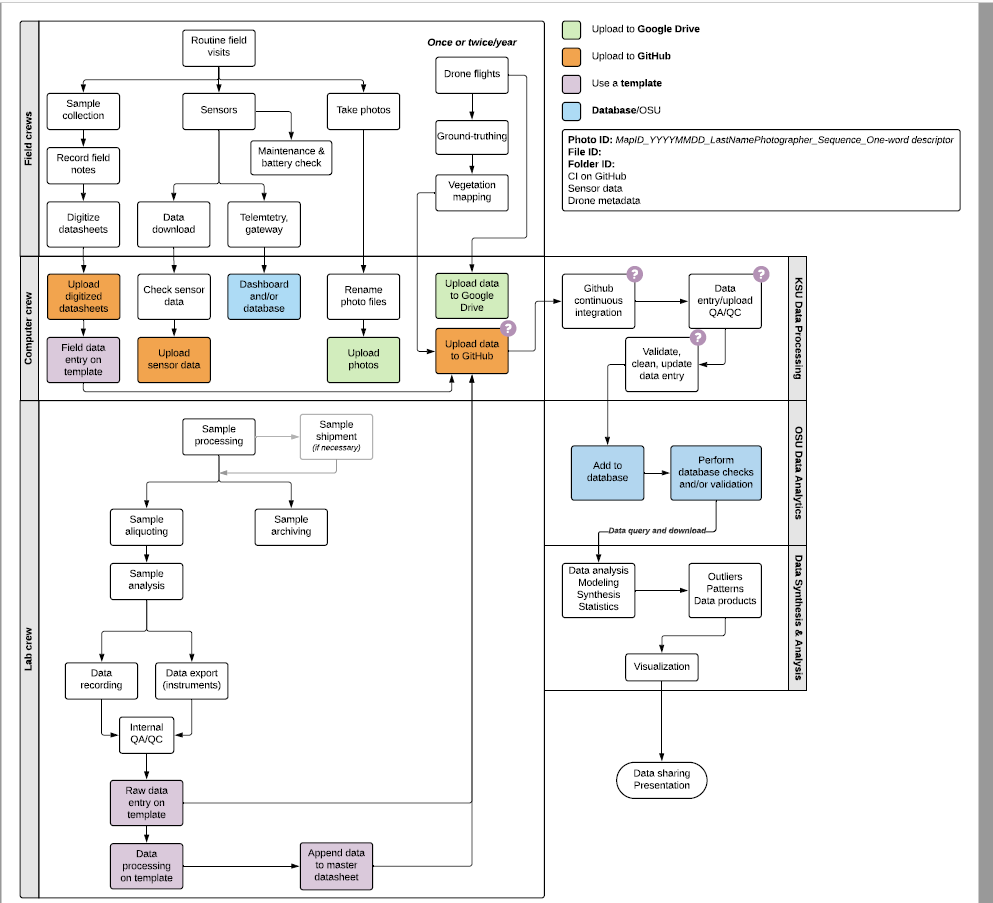

# H2Ohio Data Synthesis Project

##### Rayan Hamza | May 2021- May 2022

## Overview

<p>In this day and age, working with data has become a vital and necessary skill in many career paths, from general industry to academia, and as such, many institutions are transitioning to a more "data driven" methodology.This adapting towards data centered environments drives a need for proper data storage and maintenence. In this case, a state funded initiative revolving around around the collection, analysis, and modeling of data over the various wetlands in the state of Ohio is in need of a storage infrastructure that is robust and scalable for roughly 10 years. </p>
<p>It is clear that a need for proper data infrastructure has been established, and often times the proposed solution often revolves around a hub for data such as a large relational database or a data warehouse. While organizations could consiously choose to simply bundle their data into some cloud and access as needed, proposing a more structured model, in this case a data warehouse with relational database hubs, would prove to be more optimal, as mentioned in the following section.</p>

### Why Data Warehousing?


<p>The goal of data awrehoising is to create a trove of historical data that can be retrieved and analyzed to provide useful insigght into the organization's operations, as defined by <a href="https://www.google.com/url?sa=t&rct=j&q=&esrc=s&source=web&cd=&cad=rja&uact=8&ved=2ahUKEwiywoWJ5sX2AhUSXc0KHSf3AvwQFnoECBcQAw&url=https%3A%2F%2Fwww.investopedia.com%2Fterms%2Fd%2Fdata-warehousing.asp&usg=AOvVaw1JL6iQpJVmWHOaWHNjeSmy">investopedia</a>. Many organizations in enterprise use Data Warehousing for their business intelligence needs, such as JP Morgan Chase and Nationwide Insurance, and their are many benefits to choosing a Data Warehouse architecture, including but not limited to the following:</p>

- Relational databases within data warehouses create meaningful information by joining the tables within appropriately
- Data warehouse structures can have certain data dimentions coupled or decoupled as needed, depending on the design choice
- Data warehouses work really well in modeling and analyzing big data, and are the source of generation for online analytical processing (OLAP)
- Data warehouses are more easily scalable than unstructured data architectures
- Data warehouses optimize desired inquireies from users and stakeholders

### Expected Behavior from Clients

<p>The goal to be reached by this proposal is a data infrastructure that is optimized for desired client interfaces with the data, those would be summarized in the following:</p>

- Hydrogeologists need to insert their measurements or sample analysis into their appropriate databases
- Hydrogeologists need to select data across various tables for desired analysis
- Hydrogeologists need to project views of data that are more intuitive to read and make the process of analysis easier
- Hydrogeologists need to update data records to fix any inadequacies and address warning flags

## Designing The Infrastructure

<p>Initial decisions for this project were made from the top-down, looking at the big picture of what is needed for project and accounting for the details as we go. Actual implementation of the project is done from the bottom up, one "hub" of data in the project is given attention, and a database is created to house that data, and from there relationships with other "hubs" are then determined.</p>

### Deciding the appropriate overall architecture

<p>Data warehouses come in many different flavors that suit different needs, in this case, there are lots of hydrogeological data products that may relate to each other, but the relationships don't necesarrily have a large factor of dependence towards them. Wetland images and tabular data that isn't metadata of the images would not be directly related for example. Essentially, it seems like the H2Ohio initiative would like to have scalability in thier data with as minimal coupling between data sources as possible, which will allow the freedom to scale different "hubs" at different rates. With this motivation in mind, it feels most appropriate to choose an architecture of integrated data marts over more centralized or coupled architectures such as the hub and spoke model.</p>

#### Why Indpendent Data Marts?


<p>Other than suiting the desired properties of the H2Ohio initiative, there are additional benefits to this architecture that would be suitable for the usage of and interface with the data.</p>

- Insertion in data marts is independent, restulting in minimal to no coupling with other data marts (e.g. inserting vegitation data should not change something about turbidity data)
- Allows for hydrogeologist teams to focus on a specific mart as desired (e.g. a team focusing on water quality could mostly pay attention to the data mart involving water quality)
- It should be faster to query an individual mart than a more centralized and integrated data warehouse.

### Deciding the Schema

<p>The entire database is still a work in progress, and there are some data products that haven't had attention towards their infrastructure yet, but it is likely that their infrastructure will be influeced by neighboring data products.</p>

#### The Overall Layout of The Data Marts

In designing the overall schema for a certain data mart, it would be appropiate to follow data warehousing principles and design it in the form of a <a href="https://en.wikipedia.org/wiki/Star_schema">STAR schema</a>. STAR schemas can be defined as schemas with tables representing measureable dimentions that are combined and aggregated into what is called a FACT table, in the case of sales for example, dimentions could be tables relating to employee and product information, and the FACT Table could aggregate over the product dimention to show sales. The schema designed for hand samples taken by hydrogeologists is shown in the figures below:


The goal of this schema design was to abstract sensors from measurements, for example monitoring wells can measure multiple dimentions across the schema, but that doesn't couple those dimentions together, it simply has two separate relationships to the dimentions themselves instead of it actually being a part of the dimention. Essentially, the dimentions are abstracted from the sensors to provide flexibility. This schema was also designed for the FACT table to display as much sensor information as possible, it can be imagined as wide and denormalized table that would be rather sparse, as some dimentions are measured separately at fundamentally differenet locations and timestamps. Despite this increased width and sparsity, this FACT table can serve as the basis for many hydrogeological models created by clients to make inference on sensor data.


The goal of the schema design was to be able to get as much information as possible from the sample info table, as queries will likey start with SampleInfo information and go into desired dimentions. 

Here are some example queries and operations that can be performed in this schema that may be beneficial to poeple inquiring on the data available:

````
/* This query finds the locations of sensors that are outputting turbidity measures of rather inappropriate ranges. */
SELECT LatLong
FROM Turbidity AS T
WHERE T.turbidity > FLAGGED_CUTOFF -- flagged value defined by domain experts
````

````
/* This creates a view for looking at monitoring well measures from the FACT table*/
CREATE VIEW Monitoring_Well_measures AS
SELECT LatLong, Timestamp, Water_level, conductivity
FROM FACT
WHERE Sensor_Type = "Monitoring Well"
````

````
/* This query gets the average Nytrogen and phospherous content in each wetland site from water measurements*/
SELECT AVG(TN), AVG(TP)
FROM SampleInfo AS si INNER JOIN  WATER as w 
ON si.SampleID = w.SampleID
GROUP BY mapID;
````

It should be noted that these queries are high level for the purpose of easy interpretation.

#### Data Attributes

<p>This needs to be updated as we haven't fully figured things out yet.</p>

##### Measurements and precision

<p>Lots of the tabular data measurements are in the domain of real numbers, but the precision on the sensors and the cutoff for hydrogeologists taking hand samples was around the thousanths place. Thus tables relating to measurements such as chemistry are designed similar to the following table on water chemistry data:<p>


```
CREATE TABLE Chem_Water(
	 sampleID VARCHAR(15) UNIQUE PRIMARY KEY
	,internalSampleID VARCHAR(30) 
	,dateAnalysis DATE 
	,TN float(3) 
	,TP float(3)
	,disNH4 float(3)
	,disNO3 float(3)
	,disPO4 float(3)
	
	,foreign key(sampleID) references sampleinfo(sampleID)
);
```

Thus, precision measurements are assigned a `float(3)` value type and capped at the thousanths place.

The cutoff has been chosen as the thousanths place due to discussion with the hydrogeologists, and the precision of the measurements that is used in their analysis.

## Data Workflow

There are a number of steps to be considered before data can be uploaded into the overall database. The raw data needed can come from a variety or sourcesl, it may come from a GIS system such as ArcGIS, or it may be recorded on spreadsheet on some client's local machine, or it could be in some cloud storage unit such as google drive. The data workflow of the project has been mapped into the following diagram:



Essentially, client interface with the database happens in two ways. For insertion, clients must upload their data to a tailored github repository, and this repository will automate the insertion step as well as the preceeding QA/QC protocols dictated by the project directors. Queries to the database will likely be done via some front end web application, that way selecting data for a certain purpose becomes more user friendly than having to write direct SQL to interface with the database. Database updates and deletions will be done directly by the administration.

## Database Storage

Given the projected size of multiple terrabytes (TB) over 10 years, the database has to be stored on a distributed system or a cloud in order to handle data of that scale appropriately. The decision for where to house the data resulted in the Ohio Supercomputer Center given the academic credits that could be used to cover most of the compute, as well as additional benefits that come from this project being backed by the Ohio Department of Natural Resources (ODNR). OSC will host the database on a PostgreSQL database server, and provide administrators with access to a virtual machine in order to interface with the database directly. There will also be different priveleges assigned to different users based on their level of interaction with the database, be it an administrative role or a user role.

## Automation and Quality Assurance / Quality Control

After the schema has been defined, the wetland data needs to be formatted in a form appropriate for the schema  and inserted into the database. Data is often given as tables in excel spreadsheets and csv files, and those tables need to be inserted appropriately, with appropriate attributes in appropriate tables, and the insertions must be done in a way that maintains dependencies. Maintaining dependencies refers to foreign keys existing before tuple insertion, so for example, a table for chemical sample measurements may have a SampleID as a foreign key, and that SampleID needs to be inserted beforehand in the main "SampleInfo" table. Maintaining proper protocols for insertion as well as performing insertion automatically has been done via Github Actions automation, as well as a combination of Python and Shell scripts.

The data inserted also needs to be reviewed and confirmed or denied as appropriate, there could be possibilities of inserting a value recorded in meters into an attribute with units in centimeters, and sensors could become faulty and give readings outside of expected ranges. Sensors could also be taken out of the water, which will also give readings that are inappropriate, and sometimes, measurements may be recorded incorrectly, and real number measures could include a character, which would convert the value into a string. These potential issues can be identified and addressed in a similar manner, using Github Actions for repository automation, and a combination of python and shell scripts for the identification and resolution of problems in quality.

### Overall Automation - Github Actions

Insertion and Quality control procedures have been integrated into a single Github Actions script, this decision has been made to reduce automation complexity, and because QA/QC must preceed insertion, as inserting data of poor quality would be inappropriate for the data infrastructure and could cause problems of interpretation and ambiguity.

The following Github Actions YAML script action utilizes a shell script that runs a python script, as well as a plugin for committing changes to the github repository where raw data files are uploaded.
````
name: Formatting_Check
# Controls when the workflow will run
on:
  # Triggers the workflow on push or pull request events but only for the main branch
  push:
    branches: [ main ]
  # Allows you to run this workflow manually from the Actions tab
  workflow_dispatch:
# A workflow run is made up of one or more jobs that can run sequentially or in parallel
jobs:
  # This workflow contains a single job called "build"
  checkFormatting:
    # The type of runner that the job will run on
    runs-on: ubuntu-latest

    # Steps represent a sequence of tasks that will be executed as part of the job
    steps:
      # Checks-out your repository under $GITHUB_WORKSPACE, so your job can access it
      - uses: actions/checkout@v2
        with: # python is used in the shell script, need to make sure proper tools are installed
          python-version: 3.8
      - name: check new files # the actual action could be a series of terminal commands
        run: |
          echo "installing python and related tools..."
          python -m pip install --upgrade pip
          pip install pandas
          pip install PyGithub
          echo "finished. running QA/QC procedures..."
          chmod -R +x .
          ./check_new_files.sh
          echo "finished."
      - uses: EndBug/add-and-commit@v7
        with:
          default_author: github_actions
````

The proper python libraries are installed each time the action operates, as it is often on a clean slate Linux virtual machine, and the check_new_files.sh shell script runs a python script on the raw data files to handle insertion and QA/QC. The reason for delegating to a python script is that python is a more interpretable language, and it is easier to customize the insertion and QA/QC methodology to suit the desired protocols in python rather than using raw shell/UNIX programming.

The shell script called by Github Actions is as follows:

````
# echo "Dir: ${PWD}"
for f in ./new_data/*
do

  if [ "${f:11}" = "NEW.txt" ]
  then
    # echo "Hit NEW.txt, continuing.."
    continue
  fi
  echo "doing $f"
  python check_formatting_v2.py $f
  if [ $? -eq 0 ]
  then
    echo "Success: moving to passed_data"
    mv $f ./passed_data
    echo "moved file to passed_data."
  else
    if [ $? -eq 4 ]
    then
      echo "out of range error: issue created"
    else
      echo "unexpected error: creating issue to resolve data"
      python create-issue.py ${f:11}
      echo "issue created for ${f:11}"
    fi
    echo "Failure: moving to failed_data"
    mv $f ./failed_data
    echo "moved file to failed_data."
  fi
done
````

This shell script goes over every raw data file in the NEW directory, save for the NEW.txt description text file, and runs a formatting script in python, and if an issue is created that doesn't result in an exit code, a python script that creates an issue is called to run on the file in question. Inserted raw data files are moved into a PASSED Directory, and failed insertions are moved into the FAILED directory in the repository.

### Automatic Quality Assurcance and Quality Control

Sicne QA/QC must preceed insertion, it is best to address those decisions first before decisions involving insertion. QA/QC is done in the python script check_formatting_v2.py, which contains the following function to flag inappropriate ranges in field measurement data:

````
def RunFieldMeas(data):
    data['Flagged'] = 0
    idx = 0

    for idx, row in data.iterrows():
        # print(f"doing Row {idx}/58")
        domgL = float(row["DOmgL"])
        ph = float(row['pH'])
        tempC = float(row["tempC"])
        wd = float(row["waterDepth"])
        dopct = float(row["DOperc"])
        cond = float(row["condMicroS"])
        turb = float(row["turbNTU"])
````

`data` is a parameter of type `pandas.Dataframe`, and a column to identify flags is created, if it already exists, it is cleared for flagging to commence from scratch.

Flags themselves are set upon conditions of range violations being confirmed:

````
		# check flag conditions
        flag_title = "Check %s Flag in %s"
        flag_string = "check flagged value in %s column at row %d"
        log_string = "Flagged value in %s column at row %d"
        if ph < 4 or ph > 10:
            repo.create_issue(title=flag_title%("pH",sys.argv[1]),body=flag_string%("pH",idx),assignee="raissamendonca")
            data.at[idx, "Flagged"] = 1
            write_to_event_log(log_string%("pH",idx)) # write the flag assigment to the event_log
        if cond > 10000:
            repo.create_issue(title=flag_title%("condMicroS",sys.argv[1]),body=flag_string%("condMicroS",idx),assignee="raissamendonca")
            data.at[idx, "Flagged"] = 1
            write_to_event_log(log_string%("condMicroS",idx))
        if turb > 2000:
            repo.create_issue(title=flag_title%("turbNTU",sys.argv[1]),body=flag_string%("turbNTU",idx),assignee="raissamendonca")
            data.at[idx, "Flagged"] = 1
            write_to_event_log(log_string%("turbNTU",idx))
		### Similar conditions for other attributes .... ###
````

If ranges are deemed erronious and should not have an insertion proceed, the script exits with a special exit code:

````
 		# check error conditions
        error_title = "Check value in %s" % sys.argv[1]
        if wd > 999:
            body_string = f"Error: water depth field at row {idx} out of range."
            repo.create_issue(title=error_title,body=body_string,assignee="raissamendonca")
            write_to_event_log(body_string) # record error in event_log before crashing
            sys.exit(4)
        if tempC > 50:
            body_string = f"Error: tempC field at row {idx} out of range."
            repo.create_issue(title=error_title,body=body_string,assignee="raissamendonca")
            write_to_event_log(body_string)
            sys.exit(4)
        if domgL > 99:
            body_string = f"Error: domgL field at row {idx} out of range."
            repo.create_issue(title=error_title,body=body_string,assignee="raissamendonca")
            write_to_event_log(body_string)
            sys.exit(4)
		### Similar conditions for other attributes .... ###
		### Loop over rows ends here ###
````

Finally the function itself does not return an object, but the new `pandas.DataFrame` is saved and should be ready for database insertion

````
	# if all is well overwrite so that we have flagged column.
    data.to_csv(sys.argv[1],mode="w+")
    return None
````

This method of flagging and creating error codes to avoid insertion is simple to implement, and the data spreadsheets being inserted are currently small enough to handle iteration over a `pandas.DataFrame`, though future optimizations could involve converting into a 2D `numpy.ndarray` type vector for potentially faster iterations and tuple operations. An exit code of 4 was chosen as to not be confused with the standard exit codes of 0 or 1. The code demonstrated is prototype code, in the actual implementation, hard range values will be replaced with Final constant values saved in one data file so that minimal changes would be required for a change in flagging ranges.

### Automatic Insertion

After the QA/QC has been performed, insertion can be done using a python script or an R script as preferred. Most of the clients seem to have more experience in R than in Python, however insertions in Python are much safer because they are made atomic, meaning that if the program encounters an error some rows down the line, the rows before the error would not have been inserted, meaning the data could have it's issues resolved, and the program could be reran without fear of inserting duplicates.

The python script for insertions is prepared as follows:

````
import psycopg2
import pandas as pd

print("establising connection...")
# psycopg2 is the python library that makes connecting to postgres easier.
database = psycopg2.connect(database="HandSamplesV2",user="postgres",
                            password=PASSWORD ,
                            host="localhost")
print("connection established!")
cursor = database.cursor() # this is how we interface with the database
````

The `psycopg2` library is used given the data is being stored on a PostgreSQL database server. The actual data loading is implemented as a function:

````
def loadSampleInfo():
    print("inserting into sampleInfo...") # for tracking progress
    # pandas can read xlsx files, and I can select the sheet I'm interested in.
    df = pd.read_excel('10_St_Joseph_Confluence_Master.xlsx', 'sampleInfo', engine='openpyxl')
    colstring = "INSERT INTO sampleinfo ("
    # This is incase the sheet doesn't have all the columns or
    # has them in a different order.
    for column in df.columns:
        colstring = colstring + column + ', '
    colstring = colstring[0:-2] + ") "
    old_df = df # I use this to check dates
    df = df.to_numpy() # traversing a numpy array is much faster.
    for row in df:
        query = colstring + "VALUES (%s);"
        params = ['%s' for item in list(row)] # one %s for each column
        sqlQry = query % ', '.join(params)  # puts %s's in string appropriately
        idx = 0 # used for finding dates
        params = [] # now going to be tuple of values
        for cell in row:
            theCell = str(cell)
            if theCell == 'nan':
                theCell = None
            elif old_df.columns[idx] == 'visitDate': # format date appropriately
                theCell = str(int(float(theCell)))
                theCell = theCell[0:4] + '/'+theCell[4:6] + '/' + theCell[6:]
            params.append(theCell)
            idx += 1
        cursor.execute(sqlQry, params)
    print("sampleinfo insertion complete.")
````

For a more optimal insertion time, the data is converted to a `numpy.ndarray` before row iteration. Insertions are created in the form of insert querires to be executed by a cursor. The insertion is treated as a transaction of n insertion queries, n being the number of rows in the table being inserted into. This function is then modified for other tables, but a lot of formatting fixes, such as getting rid of `nan` values and proper date formatting are typically the same accross all tables, it is mainly the query text that changes.
